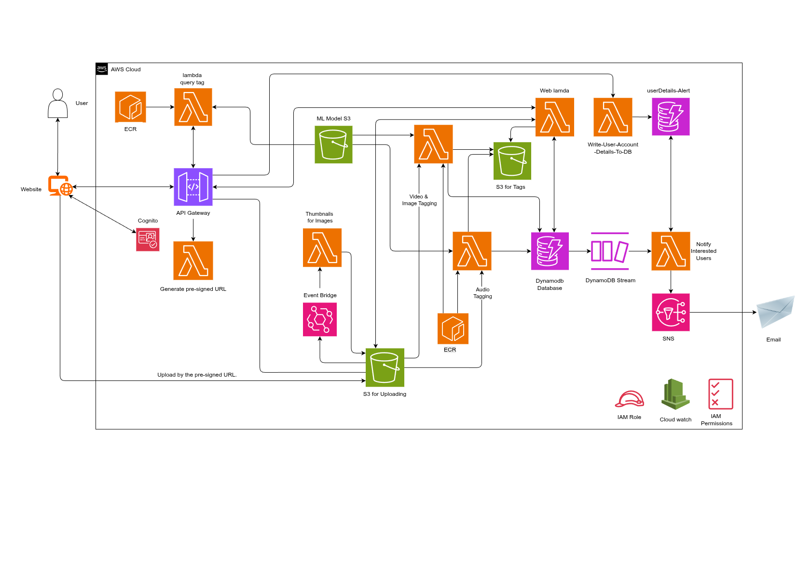

# 🐦 BirdTag: An AWS-Powered Serverless Media Storage System with Advanced Tagging Capabilities

An AWS-based serverless application designed for Monash Birdy Buddies (MBB). The system enables media storage, automatic tagging, and intelligent querying of bird-related media.

## 👥 Team Members

- Pranav : 34273905 - Security and Front-end
- Nithesh Reddy : 34791450 - Cloud ML Engineer (Back-end & Deep Learning)
- Bhargav Trimal Kulkarni : 34403671 - Security and Api
- Siqi Zhang: 34214097 - Front-end and sns

## 📌 Project Overview

**BirdTag** allows MBB members to:

- Upload media files (images, audio, video) to S3.
- Automatically generate thumbnails (for images).
- Detect bird species using machine learning and tag the media files.
- Store metadata in an AWS database.
- Search and retrieve media based on tags and bird counts.
- Manage tags and delete media files.
- Subscribe to tag-based notifications.

## Core Features

### Model Handling

- Easily update ML models used for bird detection without modifying Lambda code.
- Model is referenced and loaded dynamically for flexibility.

### File Handling

- Upload media through API Gateway.
- Trigger Lambda functions on S3 upload:
  - Generate image thumbnails.
  - Detect birds and store metadata (species tags, S3 URLs, etc.).

### 🔍 Query Support

- **Tag-based search** with bird counts:
  - e.g., `{"crow": 3}` returns files with ≥3 crows.
- **Multi-species AND search**:
  - e.g., `{"pigeon": 2, "crow": 1}` returns files with both.
- **Thumbnail-based lookup**: Get original file URL from thumbnail.
- **File-based reverse search**: Upload a file to find similar-tagged media.
- **Manual tag operations**:
  - Bulk add/remove tags via POST API.
- **Delete operations**:
  - Remove media, thumbnails, and database records.

### 📬 Tag-based Notifications

- Receive notifications via **AWS SNS** when files with specific bird tags are added.
